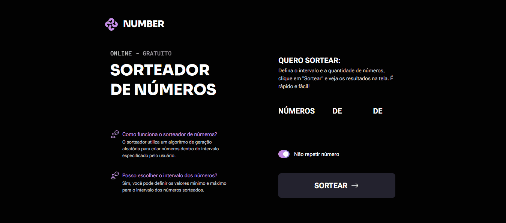

# Sorteador de números 

Aplicação simples e interativa desenvolvida para **Sorteio de Números** diretamente no navegador.<br>  
 O usuário poderá escolher quantos números deseja sortear, definir um intervalo mínimo e máximo (range) e visualizar o resultado em tempo real. Além disso, será possível ativar a opção para não repetir números no sorteio. O foco está em construir uma interface clara e funcional, adaptada para desktop e mobile, aplicando boas práticas de HTML, CSS e JavaScript para manipular os números de forma dinâmica.

## 🖼️ Prévia
<p align="center">
  
</p>

## 🚀 Funcionalidades
- ✅ Sorteio de números
- ✅ Interface intuitiva e responsiva  

## 🎯 Objetivo do Projeto
O projeto foi desenvolvido com foco em **praticar manipulação do DOM com JavaScript**, além de consolidar conceitos como:  
- Maniputação de DOM
- Criação de elementos dinâmicos  
- Manipulação de classes CSS  
- Validação de inputs  

## 💻 Tecnologias utilizadas
- **HTML5**  
- **CSS3**  
- **JavaScript (ES6+)**

## 🎨 Design

O layout e protótipo do projeto foram desenvolvidos no Figma.  
Você pode conferir [clicando aqui](https://www.figma.com/community/file/1397279380752780744).

## ✨ Aprendizados

Durante o desenvolvimento, foram praticados conceitos de manipulação do DOM e lógica de programação em JavaScript, especialmente:

- Uso de **`Match.floor`** and **`Math.random()`** para realizar sorteios de um determinado intervalo de numeros. 
- Criação de **`li`** de acordo com o total de números informado para o sorteio

## 📂 Como executar
1. Clone o repositório:  
   ```bash
   git clone https://github.com/danillo-fullstack/projeto-fullstack-sorteador-numeros.git
2. Acesse a pasta do projeto
    ```bash
   cd nome-do-repo

## 📝 Licença

Este projeto está sob a licença **MIT**. Sinta-se livre para utilizá-lo e modificá-lo.